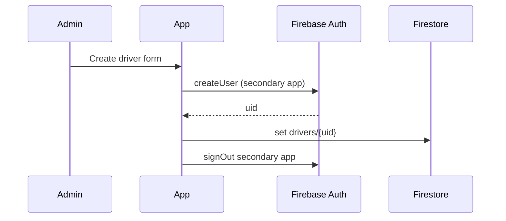
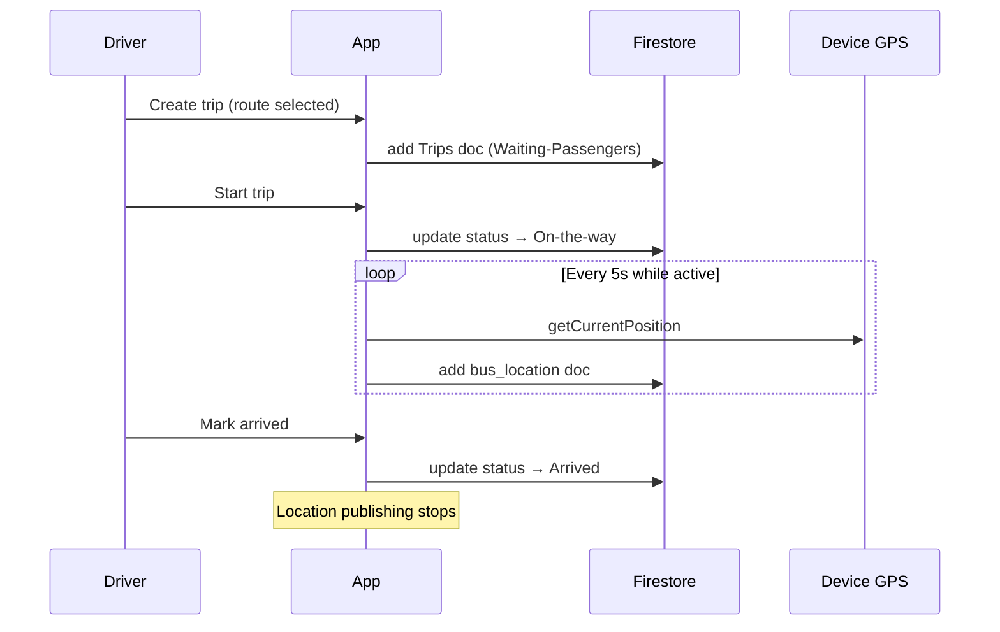
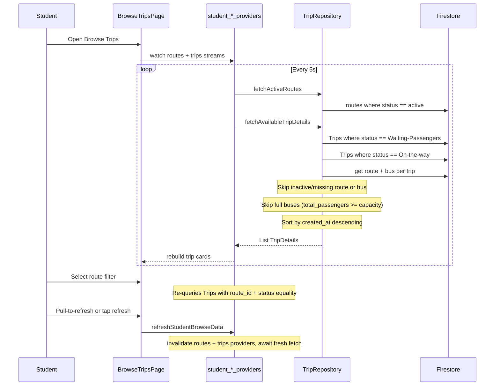
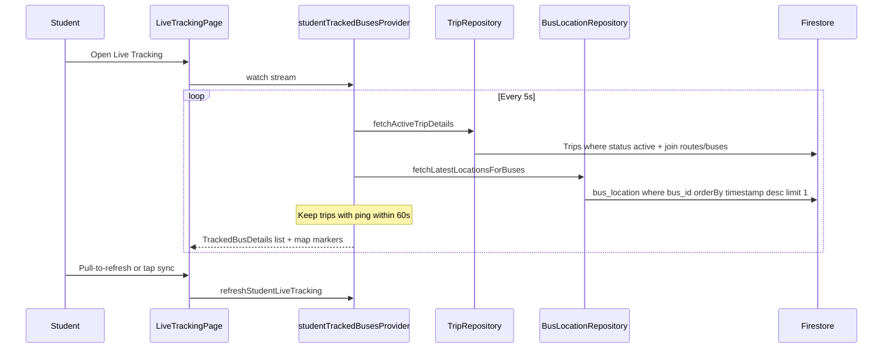
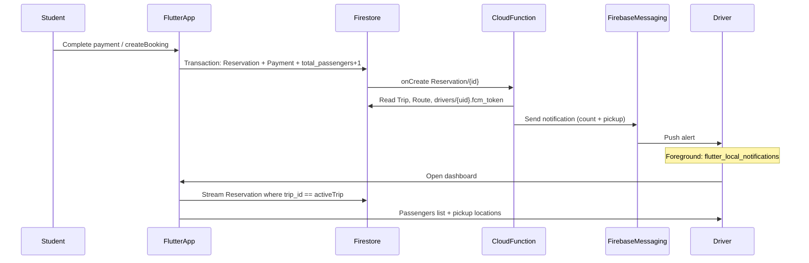

# Firebase Integration — GoAAUP Flutter App

This document describes what is **actually implemented and connected to Firebase** in this project, how data flows, and what is still local-only or not wired up yet.

---

## Overview

The app uses **Firebase Authentication** and **Cloud Firestore** for admin (bus company) and driver workflows. Students use a **guest session** stored in `SharedPreferences` — they do **not** sign in with Firebase Auth, but can **read active trips, routes, and buses** from Firestore, **book trips** (phone + conditional pickup + fake payment → `Reservation` + `Payment`), and view **My Tickets** from locally stored reservation IDs.

| Firebase service | Used? | Purpose |
|------------------|-------|---------|
| Firebase Auth | Yes | Admin & driver email/password login, password reset, driver account creation |
| Cloud Firestore | Yes | Profiles, buses, routes, trips, live bus location writes |
| Firebase Storage | No | Configured in project options only; not used in app code |
| Cloud Messaging | Yes (driver) | Push alerts when a student books; FCM token on `drivers/{uid}`; Cloud Function `notifyDriverOnBooking` |
| Firebase Analytics | No | Not integrated |

**Firebase project:** `aaup-bus-tracking` (see `.firebaserc`)

---

## Initialization & Platform Support

Firebase is initialized in `main.dart` before the app runs:

```dart
await DefaultFirebaseOptions.initializeForCurrentPlatform();
```

**Important:** `lib/firebase_options.dart` only initializes Firebase on **Android**. iOS, web, macOS, and Windows skip initialization (no-op). The Android config comes from `android/app/google-services.json`.

Dependencies in `pubspec.yaml`:

- `firebase_core`
- `firebase_auth`
- `cloud_firestore`
- `firebase_messaging` (driver push notifications)
- `flutter_local_notifications` (foreground notification display on Android)

---

## Authentication

### Roles

| Role | Firebase Auth | Firestore profile document |
|------|---------------|----------------------------|
| Admin (bus company) | Email/password | `admins/{uid}` |
| Driver | Email/password | `drivers/{uid}` |
| Student | None | None (guest mode via `SharedPreferences`) |

### Sign-in flow (`AuthRepository`)

1. User signs in with email/password via **Firebase Auth**.
2. Expected role (admin or driver) is saved locally in `SharedPreferences`.
3. App loads the matching Firestore profile from `admins/{uid}` or `drivers/{uid}`.
4. Validates:
   - Profile exists for the chosen role
   - Auth email matches profile email
   - Driver `status` is not `inactive`
   - No role mismatch (e.g. admin doc exists but user chose driver login)

### Other auth features

- **Sign out** — clears local role + Firebase Auth session
- **Password reset** — `sendPasswordResetEmail()` for admin and driver login pages
- **Driver creation (admin)** — uses a **secondary Firebase App** (`DriverCreationApp`) so creating a driver does not sign out the admin

### Routing (`AuthGate`)

- Unauthenticated → home or student guest flow
- Authenticated admin → `AdminDashboardPage`
- Authenticated driver → `DriverDashboardPage` + automatic bus location tracking

---

## Cloud Firestore

Collection names are defined in `lib/core/auth/firestore_collections.dart`.

### Collections in use

#### `admins/{uid}`

Admin profile after Firebase Auth sign-in.

| Field | Type | Notes |
|-------|------|-------|
| `email` | string | Must match Auth email |
| `name` | string | Optional display name |

**App usage:** read on login; admin dashboard loads profile via `adminProfileProvider`.

**Rules:** admin can read own doc; writes require admin role.

---

#### `drivers/{uid}`

Driver profile. Document ID = Firebase Auth UID.

| Field | Type | Notes |
|-------|------|-------|
| `email` | string | |
| `name` | string | |
| `phone_number` | string | |
| `status` | string | `active` or `inactive` |
| `fcm_token` | string | Optional. Latest FCM device token (written by driver app on login) |
| `fcm_token_updated_at` | timestamp | Optional. Last FCM token sync time |

**App usage:**

- Read on driver login and admin driver list
- Admin creates driver (Auth user + Firestore doc)
- Admin deactivates driver (`status: inactive`)
- Driver app syncs `fcm_token` on login via `DriverRepository.saveFcmToken()` (driver may update only these two fields)

**Rules:** driver reads own doc; driver may update own `fcm_token` + `fcm_token_updated_at` only; admin reads/writes all other driver fields.

---

#### `buses/{id}`

| Field | Type | Notes |
|-------|------|-------|
| `name` | string | Bus name |
| `capacity` | number | Seat count |
| `driver_id` | DocumentReference | → `drivers/{uid}` |
| `status` | string | `active` or `inactive` |

**App usage:**

- Admin: list, create, update, deactivate buses (`BusRepository`)
- Driver: resolve assigned bus for trip creation and dashboard
- Student: bus details joined when listing available trips (`BusRepository.fetchBusById`)
- Real-time streams: `activeBusesProvider`, `assignedBusForDriverProvider`

**Rules:** admin full write; driver read only for bus assigned to them; **guest read only when `status == 'active'`** (separate rule from admin/driver).

---

#### `routes/{id}`

| Field | Type | Notes |
|-------|------|-------|
| `route_name` | string | |
| `start_location` | string | |
| `end_location` | string | |
| `price` | number | Fare in ILS (decimal, e.g. 15.50) |
| `status` | string | `active` or `inactive` |

**App usage:**

- Admin: CRUD via `RouteRepository`
- Driver: fetch active routes when creating a trip
- Student: route filter chips on browse trips (`studentActiveRoutesProvider`, polled every 5s; included in `refreshStudentBrowseData()`)

**Rules:** admin write; admin and driver can read any route when authenticated; **guest (unauthenticated) read only when `status == 'active'`** (separate rule from admin/driver).

---

#### `Trips/{id}`

Note: collection name is **`Trips`** (capital T) in Firestore.

| Field | Type | Notes |
|-------|------|-------|
| `driver_id` | DocumentReference | → `drivers/{uid}` |
| `bus_id` | DocumentReference | → `buses/{id}` |
| `route_id` | DocumentReference | → `routes/{id}` |
| `price` | number | Copied from route at trip creation (ILS) |
| `total_passengers` | number | Passenger count; set to **0** on create |
| `status` | string | See trip lifecycle below |
| `created_at` | timestamp | Set on create |
| `departure_time` | timestamp | Set when trip starts |
| `arrival_time` | timestamp | Set when trip completes |

**Trip lifecycle**

```
Waiting-Passengers  →  On-the-way  →  Arrived
     (create)           (start)        (complete)
```

New trips are created with `total_passengers: 0`. Driver trip creation also requires the selected route to have `price > 0`.

Active statuses (used for queries): `Waiting-Passengers`, `On-the-way`.

**Student booking vs trip status:** pickup handling depends on status at booking time (re-checked inside the booking transaction):

| Trip status at booking | Student pickup UI | `pickup_location` on `Reservation` | `pickup_coordinates` |
|------------------------|-------------------|------------------------------------|------------------------|
| `Waiting-Passengers` | None (skip pickup step) | Route `start_location` (auto) | Not written |
| `On-the-way` | Required text + optional GPS | Student-provided description | Optional GeoPoint if GPS captured |

Constants: [`TripStatus`](lib/features/trips/domain/trip_status.dart) (`waitingPassengers`, `onTheWay`). UI helper: `Trip.requiresPickupInput` in [`trip_model.dart`](lib/features/student/domain/models/trip_model.dart).

**App usage (`TripRepository`):**

- Driver creates trip (requires assigned active bus + route with price)
- Driver starts trip / marks arrived
- Real-time active trip stream for dashboard (`watchActiveTripForDriver`, wired via `trip_providers.dart`)
- Paginated trip history for driver (indexed query with `created_at` + `__name__` tie-break; client-side sort fallback)
- **Student browse:** `fetchAvailableTrips` / `fetchAvailableTripDetails`
  - Excludes `Arrived` trips (queries each active status with equality, not `whereIn`, to align with security rules)
  - Merges results and sorts by `created_at` descending (newest first)
  - Optional `route_id` filter
  - Joins route + bus docs per trip; skips trips with missing/inactive route or bus
  - Excludes full buses (`trip.totalPassengers >= bus.capacity`)
  - Polled every **5 seconds** via `studentAvailableTripsProvider`; manual refresh via `refreshStudentBrowseData()` (invalidates routes + trips providers)

**UI seat counts:** [`Trip.fromTripDetails`](lib/features/student/domain/models/trip_model.dart) maps `TripDetails` → student `Trip` UI model, computing `availableSeats` as `bus.capacity - total_passengers`. [`TripDetails.hasAvailableSeats`](lib/features/trips/domain/trip_details.dart) remains available for display logic but browse filtering is done in the repository.

**Rules:** authenticated users can read all trips; **guest read only for `Waiting-Passengers` or `On-the-way`** (each status has its own rule, required for secure list queries); drivers create/update only their own trips; admin can delete.

---

#### `bus_location/{autoId}`

Append-only location pings while a driver has an active trip.

| Field | Type | Notes |
|-------|------|-------|
| `bus_id` | DocumentReference | → `buses/{id}` |
| `location` | GeoPoint | lat/lng |
| `timestamp` | timestamp | Server timestamp |

**App usage:**

- **Write** from driver side: `BusLocationTrackingController` publishes every **5 seconds** while trip status is active
- **Read** from student side: [`LiveTrackingPage`](lib/features/student/presentation/pages/live_tracking_page.dart) polls latest ping per active-trip bus via `BusLocationRepository.fetchLatestLocationsForBuses`
- Started automatically when driver dashboard loads (`AuthGate` watches `busLocationTrackingProvider`)
- Uses device GPS (`geolocator`) after location permission is granted

**Student read query:** `bus_location` where `bus_id == buses/{id}` orderBy `timestamp` desc limit 1 (indexed). Pings older than **120 seconds** are treated as stale and hidden. Full buses (`total_passengers >= capacity`) are excluded from live tracking.

**Rules:** authenticated read; guest read (student live tracking); driver create only for their assigned bus; admin update/delete.

---

#### `Reservation/{id}`

Student booking records. Document ID is used in `qr_data` for driver scanner check-in.

| Field | Type | Notes |
|-------|------|-------|
| `trip_id` | DocumentReference | → `Trips/{id}` |
| `reservation_time` | timestamp | Server timestamp at booking |
| `phone_number` | string | Normalized Palestinian mobile number |
| `qr_data` | string | JSON string: `{"id":"{reservationId}","trip":"{route}","bus":"{busName}"}` |
| `status` | string | `waiting-boarding` (default) or `Boarded` |
| `pickup_location` | string | Required on create. Auto-set to route `start_location` when trip is `Waiting-Passengers`; student-provided text when `On-the-way` |
| `pickup_coordinates` | GeoPoint | Optional. Only written when trip is `On-the-way` and student captures GPS |

**App usage (`ReservationRepository.createBooking`):**

- Runs in a Firestore **transaction** that:
  1. Re-reads the trip and rejects if status is not active or `total_passengers >= bus capacity`
  2. Resolves pickup based on trip status:
     - **`Waiting-Passengers`**: sets `pickup_location` to route start (no coordinates)
     - **`On-the-way`**: requires non-empty `pickup_location`; optional `pickup_coordinates`
  3. Creates `Reservation` + `Payment`
  4. Increments `Trips.total_passengers` by 1
- Booking flow: `TripDetailsPage` → `PhoneEntryPage` → (`PickupLocationPage` when trip is `On-the-way`) → `PaymentGatewayPage`
- Normalizes and validates Palestinian phone via [`PhoneNumberValidator`](lib/core/validation/phone_number_validator.dart)
- Builds `qr_data` as a JSON string via `jsonEncode` with `{ id, trip, bus }` (see [`ReservationQrDataCodec`](lib/core/reservation/reservation_qr_data_codec.dart))
- After success, [`PaymentGatewayPage`](lib/features/student/presentation/pages/payment_gateway_page.dart) saves phone + reservation ID locally, calls `refreshStudentBrowseData()`, and invalidates `activeTicketsProvider`

**Fetching reservations:** My Tickets loads docs by **stored reservation IDs** (individual `get` per ID, batched in groups of 10 for loop organization). Each reservation is joined with its trip, bus, route, and payment. `fetchActiveReservationsByIds` keeps only tickets whose linked trip is still `Waiting-Passengers` or `On-the-way`. Pickup fields are surfaced on confirmation and ticket detail screens.

**Driver check-in (`ReservationRepository.checkInReservation`):**

- Triggered from [`DriverScannerPage`](lib/features/driver/presentation/pages/scanner_page.dart) when the driver scans a student QR code (requires an active trip on the dashboard).
- Decodes `qr_data` via [`ReservationQrDataCodec`](lib/core/reservation/reservation_qr_data_codec.dart) to get the reservation ID.
- Runs a Firestore **transaction** that sets `status` from `waiting-boarding` to `Boarded` when:
  - The reservation exists and belongs to the driver’s active `trip_id`
  - The reservation is still `waiting-boarding`
- Outcomes:
  - **`waiting-boarding`** → updated to **`Boarded`**; success dialog; passenger list on dashboard updates via `driverTripPassengersProvider`
  - **`Boarded`** → warning: not a valid reservation (already checked in)
  - **Wrong trip** → warning when reservation belongs to a different trip
  - **Missing / invalid QR** → invalid QR dialog
- Local scan history in SharedPreferences is kept for export only; Firestore status is the source of truth.

**Rules:** guest (unauthenticated) create with field validation via `isValidReservationCreate()` + `isValidReservationPickup()`; guest read; driver update via `isDriverBoardReservationUpdate()` (`waiting-boarding` → `Boarded` only, for their trip); admin update/delete.

---

#### `Payment/{id}`

Payment record linked to a reservation (fake/demo checkout for now).

| Field | Type | Notes |
|-------|------|-------|
| `reservation_id` | DocumentReference | → `Reservation/{id}` |
| `amount` | number | Trip fare in ILS |
| `payment_status` | string | `completed` for demo payment |
| `payment_time` | timestamp | Server timestamp at payment |

**App usage:** created in the same booking transaction as the reservation.

**Rules:** guest create with field validation; guest read; admin update/delete.

---

## Security Rules & Indexes

- **Rules file:** [`firestore.rules`](firestore.rules) (deployed via `firebase.json`)
- **Indexes:** [`firestore.indexes.json`](firestore.indexes.json)

### Guest (student) read access

Students have **no Firebase Auth** session. Public read is enabled via **separate `allow read` rules** per collection (not a single OR with admin/driver), so list queries stay valid under [Firestore secure query rules](https://firebase.google.com/docs/firestore/security/rules-query):

| Collection | Guest can read |
|------------|----------------|
| `routes/{id}` | Documents where `status == 'active'` |
| `buses/{id}` | Documents where `status == 'active'` |
| `Trips/{id}` | Documents where `status == 'Waiting-Passengers'` or `status == 'On-the-way'` |
| `Reservation/{id}` | All documents (for My Tickets by stored reservation IDs) |
| `Payment/{id}` | All documents (for ticket payment details) |
| `bus_location/{id}` | All documents (latest ping per bus for student live map) |

**Guest writes (booking):** unauthenticated users can create `Reservation` and `Payment` documents and increment `Trips.total_passengers` by exactly 1 on active trips (`Waiting-Passengers` or `On-the-way`), validated by `isGuestBookingUpdate()` in security rules. Reservation creates require non-empty `pickup_location`; `pickup_coordinates` is forbidden for `Waiting-Passengers` trips and optional for `On-the-way` trips (`isValidReservationPickup`). The app also re-validates trip status, pickup rules, and capacity inside the booking transaction before writing.

**Reservation create validation (`isValidReservationCreate` + `isValidReservationPickup`):**

| Linked trip status | `pickup_location` | `pickup_coordinates` |
|--------------------|-------------------|----------------------|
| `Waiting-Passengers` | Required non-empty string | Must not be present |
| `On-the-way` | Required non-empty string | Optional `latlng` |

Other required reservation fields on create: `trip_id` (path to active trip), `phone_number`, `qr_data`, `status == waiting-boarding`, `reservation_time == request.time`.

Admin and driver retain broader authenticated read rules on the same collections.

**Important:** After changing rules locally, deploy before testing on device:

```bash
firebase deploy --only firestore:rules,firestore:indexes
```

### Composite indexes

- Trips by `driver_id` + `status`
- Trips by `driver_id` + `created_at` DESC (trip history pagination)
- Trips by `driver_id` + `created_at` DESC + `__name__` DESC (stable cursor pagination)
- Trips by `route_id` + `status` (student route filter)
- Buses by `driver_id` + `status`
- Payment by `reservation_id`
- Reservation by `phone_number` + `reservation_time` DESC (defined for future/optional phone-based lookup; My Tickets uses stored reservation IDs instead)
- Reservation by `trip_id` + `reservation_time` DESC (driver dashboard passenger list)
- `bus_location` by `bus_id` + `timestamp` DESC (student live tracking: latest ping per bus)

Trip history falls back to client-side sorting if the composite index is missing (`failed-precondition` with index hint).

---

## Feature Map: What Connects to Firebase

### Bus company (admin)

| Feature | Firebase connected? |
|---------|---------------------|
| Login / logout | Yes — Auth + `admins/{uid}` |
| Password reset | Yes |
| Manage drivers (create, list, deactivate) | Yes — Auth (secondary app) + `drivers` |
| Manage buses (create, edit, deactivate) | Yes — `buses` |
| Manage routes (create, edit, deactivate) | Yes — `routes` |
| QR / payment / reservations | Partial — admin QR generation is local mock; student booking writes `Reservation` + `Payment` |

### Driver

| Feature | Firebase connected? |
|---------|---------------------|
| Login / logout | Yes — Auth + `drivers/{uid}` |
| Password reset | Yes |
| View assigned bus | Yes — `buses` stream |
| Create / start / complete trip | Yes — `Trips` |
| Trip history | Yes — `Trips` queries |
| Live GPS publishing during active trip | Yes — writes to `bus_location` |
| Booking push notifications | Yes — FCM via Cloud Function on `Reservation` create; token synced on driver login |
| Passenger list + pickup locations | Yes — driver dashboard streams `Reservation` by active `trip_id` |
| QR scanner (student check-in) | Yes — updates `Reservation.status` to `Boarded` via `checkInReservation`; rejects already-boarded and wrong-trip tickets |

### Student

| Feature | Firebase connected? |
|---------|---------------------|
| Guest “login” | No — `SharedPreferences` only |
| Browse trips | Yes — [`BrowseTripsPage`](lib/features/student/presentation/pages/browse_trips_page.dart) reads active `Trips`, `routes`, and `buses`; **excludes `Arrived` and full buses**; route filter chips; **5s poll**; **pull-to-refresh**, header refresh button, and error retry via `refreshStudentBrowseData()` |
| Live bus tracking map | Yes — [`LiveTrackingPage`](lib/features/student/presentation/pages/live_tracking_page.dart) reads active bookable `Trips` + latest `bus_location` per bus; **sorted nearest-first** using user GPS; distance shown from user; tap bus → [`TripDetailsPage`](lib/features/student/presentation/pages/trip_details_page.dart); map marker tap focuses bus; **full buses hidden**; **5s poll**; pull-to-refresh + header sync |
| Trip details → booking | Yes — [`TripDetailsPage`](lib/features/student/presentation/pages/trip_details_page.dart) → [`PhoneEntryPage`](lib/features/student/presentation/pages/phone_entry_page.dart) → ([`PickupLocationPage`](lib/features/student/presentation/pages/pickup_location_page.dart) when trip is `On-the-way`) → [`PaymentGatewayPage`](lib/features/student/presentation/pages/payment_gateway_page.dart) |
| Reservations / payments | Yes — phone entry → conditional pickup (on-the-way only) → fake payment → Firestore transaction (`Reservation` with `pickup_location` / optional `pickup_coordinates`, `Payment`, `Trips.total_passengers`); refreshes browse list + tickets after booking |
| Booking confirmation | Yes — [`BookingConfirmationPage`](lib/features/student/presentation/pages/booking_confirmation_page.dart) shows QR from `qr_data`, pickup location, and GPS indicator; links to browse / My Tickets |
| Ticket details | Yes — [`TicketDetailsPage`](lib/features/student/presentation/pages/ticket_details_page.dart) reads joined `ReservationDetails` including pickup fields |
| My Tickets | Yes — [`MyTicketsPage`](lib/features/student/presentation/pages/my_tickets_page.dart); loads local reservation IDs; shows only tickets for **active** trips; 5s poll; pull-to-refresh + refresh on page open |

---

## Architecture (code layout)

```
lib/
├── firebase_options.dart          # Android Firebase config
├── core/auth/
│   ├── auth_repository.dart       # Auth + profile resolution
│   ├── auth_providers.dart        # Riverpod providers
│   ├── auth_gate.dart             # Role-based home routing
│   └── firestore_collections.dart # Collection name constants
├── core/firestore/
│   └── firestore_refresh_constants.dart  # Shared list refresh interval (5s)
├── core/notifications/
│   ├── notification_constants.dart       # FCM channel + payload keys
│   ├── driver_notification_service.dart  # Permission, token sync, foreground display
│   ├── driver_notification_providers.dart # Init controller on driver auth
│   └── driver_notification_background.dart # Background message handler
├── features/bus_company/data/
│   ├── bus_repository.dart
│   ├── driver_repository.dart
│   └── route_repository.dart
├── features/student/
│   ├── data/
│   │   ├── student_route_providers.dart
│   │   ├── student_trip_providers.dart      # Browse poll + refreshStudentBrowseData()
│   │   ├── reservation_repository.dart      # Booking transaction + reservation joins
│   │   ├── reservation_providers.dart       # reservationRepositoryProvider, local storage
│   │   ├── student_reservation_providers.dart  # activeTicketsProvider, refreshActiveTickets()
│   │   ├── student_live_tracking_providers.dart  # studentTrackedBusesProvider, refreshStudentLiveTracking()
│   │   └── student_booking_local_storage.dart  # StudentBookingStorageKeys
│   ├── domain/
│   │   ├── models/trip_model.dart           # Trip UI adapter; requiresPickupInput for on-the-way
│   │   ├── models/reservation_profile.dart  # pickup_location, pickup_coordinates
│   │   ├── models/payment_profile.dart
│   │   ├── models/reservation_details.dart
│   │   ├── reservation_status.dart          # waiting-boarding, Boarded
│   │   └── payment_status.dart              # completed, pending, failed
│   └── presentation/pages/
│       ├── browse_trips_page.dart
│       ├── trip_details_page.dart
│       ├── phone_entry_page.dart
│       ├── pickup_location_page.dart        # On-the-way pickup text + optional GPS
│       ├── payment_gateway_page.dart        # Fake/demo checkout
│       ├── booking_confirmation_page.dart
│       ├── my_tickets_page.dart
│       ├── live_tracking_page.dart
│       └── ticket_details_page.dart
├── core/permissions/
│   └── location_permission_service.dart     # GPS permission for pickup + live tracking
├── core/validation/
│   └── phone_number_validator.dart          # Palestinian phone validation
├── features/trips/
│   ├── data/
│   │   ├── trip_repository.dart             # fetchAvailableTrips, fetchAvailableTripDetails, fetchActiveTripDetails
│   │   └── trip_providers.dart              # tripRepositoryProvider, driver active trip streams
│   └── domain/
│       ├── trip_profile.dart                # Firestore trip model; defaultTotalPassengers = 0
│       └── trip_details.dart                # Trip + route + bus join; hasAvailableSeats
├── features/driver/
│   ├── data/
│   │   └── driver_reservation_providers.dart  # driverTripReservationsProvider
│   └── presentation/pages/
│       └── dashboard_page.dart            # Passengers list + pickup + Open in Maps
└── features/tracking/
    ├── data/
    │   ├── bus_location_repository.dart     # publish + fetch latest location per bus
    │   ├── bus_location_providers.dart
    │   └── bus_location_tracking_controller.dart
    └── domain/
        ├── bus_location_constants.dart
        ├── bus_location_profile.dart
        └── tracked_bus_details.dart
```

State management uses **flutter_riverpod**. Repositories talk to Firestore/Auth; UI pages watch `StreamProvider` / `FutureProvider` instances.

### Student browse providers

| Provider / helper | Type | Purpose |
|----------|------|---------|
| `selectedRouteFilterProvider` | `StateProvider<String?>` | Selected route id; `null` = all routes |
| `studentActiveRoutesProvider` | `StreamProvider` | Polls `RouteRepository.fetchActiveRoutes()` every 5s |
| `studentAvailableTripsProvider` | `StreamProvider` | Polls `TripRepository.fetchAvailableTripDetails()` every 5s; watches route filter |
| `refreshStudentBrowseData()` | `Future<void>` | Invalidates routes + trips providers and awaits fresh data (pull-to-refresh, header button, error retry) |
| `reservationRepositoryProvider` | `Provider` | Shared `ReservationRepository` (injected bus + route repos) |
| `studentBookingLocalStorageProvider` | `Provider` | `SharedPreferences` wrapper for phones + reservation IDs |
| `activeTicketsProvider` | `StreamProvider` | Polls `fetchActiveReservationsByIds` from local reservation IDs every 5s |
| `refreshActiveTickets()` | `Future<void>` | Invalidates active tickets provider (used on My Tickets open + pull-to-refresh) |
| `studentTrackedBusesProvider` | `StreamProvider` | Polls active trips + latest `bus_location` per bus every 5s; excludes full buses and stale pings; UI sorts by user distance |
| `refreshStudentLiveTracking()` | `Future<void>` | Invalidates live tracking provider (pull-to-refresh, header sync, error retry) |

### Driver notification & bookings providers

| Provider / helper | Type | Purpose |
|----------|------|---------|
| `driverNotificationControllerProvider` | `Provider` | Starts FCM token sync + foreground handlers when driver is authenticated |
| `driverTripReservationsProvider` | `StreamProvider` | Real-time `Reservation` list for the driver’s active trip (`trip_id` query) |

### Student local storage (booking)

| Key (`StudentBookingStorageKeys`) | Purpose |
|-----|---------|
| `student_booking_phone_numbers` | All phone numbers used for booking on this device (JSON array) |
| `student_booking_reservation_ids` | Reservation doc IDs created on this device (for My Tickets; JSON array) |

Refresh interval: `FirestoreRefreshConstants.listIntervalSeconds` (5) in [`lib/core/firestore/firestore_refresh_constants.dart`](lib/core/firestore/firestore_refresh_constants.dart).

On fetch error, streams yield an empty list and retry on the next interval (no cached error state). The browse page also offers an explicit **Retry** button that calls `refreshStudentBrowseData()`.

---

## Data flow diagrams

### Admin creates a driver



### Driver trip + location tracking



---

### Student browse trips



### Student booking flow

Pickup is **conditional on trip status** at booking time. Status is re-read inside the Firestore transaction so a trip that becomes unavailable while the student is on the phone or pickup screen is rejected.

```mermaid
sequenceDiagram
  participant Student
  participant PhonePage as PhoneEntryPage
  participant PickupPage as PickupLocationPage
  participant PayPage as PaymentGatewayPage
  participant Repo as ReservationRepository
  participant Local as SharedPreferences
  participant FS as Firestore

  Student->>PhonePage: Enter Palestinian phone
  alt Trip status is On-the-way
    PhonePage->>PickupPage: trip + phone
    Student->>PickupPage: Enter pickup text (+ optional GPS)
    PickupPage->>PayPage: trip + phone + pickup
  else Trip status is Waiting-Passengers
    PhonePage->>PayPage: trip + phone
  end
  Student->>PayPage: Complete Payment
  PayPage->>Repo: createBooking
  Repo->>FS: Transaction
  Note over FS: Re-read trip; reject if inactive or full
  alt Waiting-Passengers
    Note over FS: pickup_location = route start; no coordinates
  else On-the-way
    Note over FS: pickup_location required; optional pickup_coordinates
  end
  Note over FS: Reservation + Payment + total_passengers+1
  Repo-->>PayPage: ReservationDetails
  PayPage->>Local: Save phone + reservation ID
  PayPage->>Providers: refreshStudentBrowseData + invalidate activeTickets
  PayPage->>Student: BookingConfirmationPage with QR + pickup
```

### Student live tracking



### Driver booking notification

When a student completes booking, a Cloud Function sends FCM to the trip driver. The driver dashboard also streams reservations for the active trip.



**Notification payload (`data` fields):**

| Key | Value |
|-----|-------|
| `type` | `new_booking` |
| `tripId` | Linked trip document id |
| `reservationId` | New reservation id |
| `totalPassengers` | Updated `Trips.total_passengers` (string) |
| `pickupLocation` | Reservation `pickup_location` |
| `pickupLat` / `pickupLng` | Present when `pickup_coordinates` exists |
| `maskedPhone` | Last 4 digits masked (e.g. `***1234`) |

**Cloud Function:** `functions/src/index.ts` → `notifyDriverOnBooking` (Firestore `onDocumentCreated` on `Reservation/{reservationId}`).

**Client:** [`DriverNotificationService`](lib/core/notifications/driver_notification_service.dart) requests permission, calls `FirebaseMessaging.getToken()`, saves token via [`DriverRepository.saveFcmToken`](lib/features/bus_company/data/driver_repository.dart). Initialized from [`AuthGate`](lib/core/auth/auth_gate.dart) when role is driver.

---

## Cloud Messaging (FCM) — driver only

| Component | Location | Role |
|-----------|----------|------|
| FCM token sync | `lib/core/notifications/driver_notification_service.dart` | Android driver login → `drivers/{uid}.fcm_token` |
| Foreground display | `flutter_local_notifications` | Shows notification when app is open |
| Background handler | `lib/core/notifications/driver_notification_background.dart` | Registered in `main.dart` |
| Server send | `functions/src/index.ts` | `notifyDriverOnBooking` on reservation create |
| Android permission | `android/app/src/main/AndroidManifest.xml` | `POST_NOTIFICATIONS` + default channel `driver_booking_channel` |

**Deploy (requires Blaze plan for Cloud Functions):**

```bash
cd functions && npm install && npm run build
firebase deploy --only functions,firestore:rules,firestore:indexes
```

If the driver has no `fcm_token`, the function logs and skips send; the dashboard passenger stream still updates.

---

## What is not connected yet (gaps)

1. **Real payment gateway** — student checkout uses a fake/demo payment page; no PayPal/Apple Pay backend.
2. **Non-Android platforms** — Firebase not initialized on iOS/web/desktop in current code; FCM is Android-only in this codebase.
3. **Firebase Storage, Analytics** — not used.
4. **Student/admin push notifications** — not implemented.

---

## Manual setup notes (for developers)

1. **Admin accounts** — create user in Firebase Auth, then add document `admins/{uid}` with `email` and optional `name`.
2. **Driver accounts** — prefer creating via admin “Manage Drivers” UI (creates Auth + Firestore together).
3. **Deploy rules/indexes/functions** — required for student browse, booking, live tracking, and driver notifications. From project root:
   ```bash
   cd functions && npm install && npm run build
   firebase deploy --only firestore:rules,firestore:indexes,functions
   ```
4. **Driver FCM testing** — log in as driver on Android; confirm `drivers/{uid}.fcm_token` in Firestore. Book a trip as student; driver should receive push + see passenger on dashboard.
5. **Testing** — use an Android device or emulator; Firebase init is Android-only in this codebase. After changing providers or widget types (`StatefulWidget` → `ConsumerWidget`), use a **full restart** (`flutter run` or **R**), not hot reload alone.

---

## Related files

| File | Role |
|------|------|
| `firebase.json` | Firestore rules, indexes, and Cloud Functions config |
| `functions/src/index.ts` | `notifyDriverOnBooking` — FCM on reservation create |
| `firestore.rules` | Security rules including guest booking, driver FCM token update (`isDriverFcmTokenUpdate`), and driver reservation check-in (`isDriverBoardReservationUpdate`) |
| `firestore.indexes.json` | Composite indexes |
| `.firebaserc` | Project alias |
| `android/app/google-services.json` | Android Firebase app config |
| `lib/firebase_options.dart` | Dart Firebase options (Android) |
| `lib/features/student/data/student_route_providers.dart` | Student route filter data source |
| `lib/features/student/data/student_trip_providers.dart` | Student available trips poll, route filter, `refreshStudentBrowseData()` |
| `lib/features/student/presentation/pages/browse_trips_page.dart` | Student browse trips UI (pull-to-refresh, header refresh, error retry) |
| `lib/features/trips/data/trip_providers.dart` | Shared `TripRepository` + driver active-trip stream providers |
| `lib/features/trips/domain/trip_profile.dart` | Firestore trip model (`totalPassengers`, `defaultTotalPassengers`) |
| `lib/features/trips/domain/trip_details.dart` | Joined trip + route + bus model; `hasAvailableSeats` |
| `lib/features/trips/data/trip_repository.dart` | Trip queries; browse list sorted by `created_at` desc; full-bus filter |
| `lib/features/student/domain/models/trip_model.dart` | UI `Trip` adapter from `TripDetails` (seat counts for cards) |
| `lib/features/student/data/reservation_repository.dart` | Booking transaction; conditional pickup resolution; reservation/payment joins; driver `checkInReservation` |
| `lib/features/student/presentation/pages/pickup_location_page.dart` | On-the-way pickup text + optional GPS before payment |
| `lib/features/student/presentation/pages/phone_entry_page.dart` | Phone entry; branches to pickup or payment by trip status |
| `lib/features/student/data/student_reservation_providers.dart` | `activeTicketsProvider`, `refreshActiveTickets()` |
| `lib/features/student/data/student_live_tracking_providers.dart` | `studentTrackedBusesProvider`, `refreshStudentLiveTracking()` |
| `lib/features/student/presentation/pages/live_tracking_page.dart` | Student live map + bus list from `bus_location` |
| `lib/features/student/data/student_booking_local_storage.dart` | Local phone + reservation ID persistence |
| `lib/features/student/presentation/pages/my_tickets_page.dart` | Active tickets list (active trips only) |
| `lib/features/student/presentation/pages/payment_gateway_page.dart` | Demo checkout; triggers Firestore booking |
| `lib/core/validation/phone_number_validator.dart` | Palestinian phone validation |
| `lib/core/notifications/driver_notification_service.dart` | Driver FCM permission, token sync, foreground notifications |
| `lib/core/notifications/driver_notification_providers.dart` | `driverNotificationControllerProvider` |
| `lib/features/driver/data/driver_reservation_providers.dart` | `driverTripReservationsProvider` |
| `lib/features/driver/presentation/pages/dashboard_page.dart` | Driver dashboard with Passengers section |
| `lib/features/bus_company/data/driver_repository.dart` | `saveFcmToken()` for driver push |
